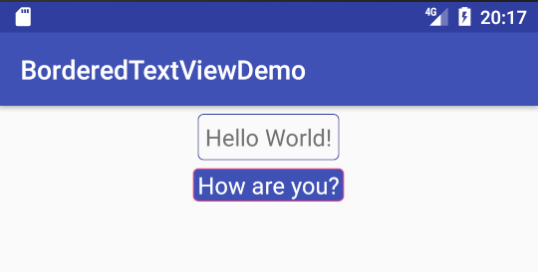

# BorderedTextView
A simple TextView with border



# Usage
Simply include in your layout like so...

```xml
    <ru.nextexit.borderedtextview.BorderedTextView
        android:layout_width="wrap_content"
        android:layout_height="wrap_content"
        android:textSize="18sp"
        android:textColor="@android:color/white"
        android:text="Hello world?"
        android:layout_marginTop="6dp"
        app:borderRadius="4dp"
        app:borderWidth="1dp"
        app:borderPaddingLeft="4dp"
        app:borderPaddingRight="4dp"
        app:backgroundColor="@color/colorPrimary"
        app:borderColor="@color/colorAccent"/>
```
